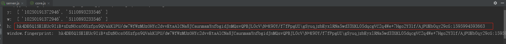
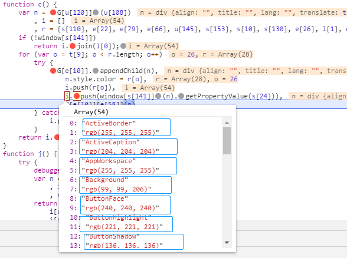

##### 某易易盾

doing list：

- [ ] 可疑用户-滑动拼图验证码  (后续有精力再继续研究)

目测步骤：

1.一次请求获取图片链接、token

2.二次请求就是验证滑块参数

---

#### 最后测试情况：998/1000，通过率为：99.98%

PS：如需要提高准确率的话，可以使用深度学习来识别滑块缺口的位置，但是本人比较懒，目前的通过率已经够用了

2020.08.12

1.破解滑块轨迹，根据滑块距离随机生成轨迹加密参数

2.需要注意的是指纹 fp 的生成，本文件里面提供了好几个生成 fp 的函数，具体自己去查看代码

2020.07.29

请求步骤2/3是没有问题的，但是到了请求步骤4/5，就出现通过率很低的情况，约为15%.

这个通过率很惨啊！！

鄙人还没找到是哪里隐藏了检测点，希望有高人指点一下，谢谢.

PS：本地已经补全了：屏幕大小、色彩/像素深度、浏览器插件、语言、GMT时差 等属性，

但是就是请求拿token的时候，就常常不通过，{"error":100,"msg":"param check error"}，报参数错误，

请大佬们指点一下，存在什么问题，导致通过率这么低。

而且我发现浏览器，对指纹fp参数错误的情况也是能够通过请求的，这就很尴尬了：比如下面这种情况：

小弟知道哪里错了！！！

在这里，这个get请求，不能直接将参数放到url里面去请求；

得需要单独拿出来，作为字典参数请求！！！

将：

改为下面这种请求方式：

目前测试 165 次，全部通过

---

目录介绍：
    
- analysis： 里面的文件是源码分析的，部分代码有注释
- source：   最后的整合后的目录
- statics：  静态文件，保存图片的，有失败的图片，可以查看，备于分析原因

